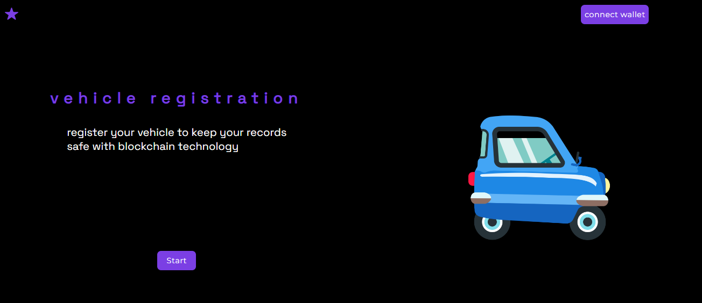

 

    
  

  
  

    
 # project for Moralis web3 hackathon and Google Cloud year 2022
    
  

    
     <a align="center" href="" target="_blank">
       <h1 align="center">Vehicle Registration</h1>
    </a>
  

    register your vehicle to keep your records
safe with blockchain technology
  

   

 
 # the idea 

The idea of this project was born with the intention of improving transparency in the information offered about vehicles.

#  the problem 

The problem is that people could hide their vehicle information when trying to negotiate with another person.

#  The Solution 

the solution offered is to use blockchain technology to protect the data

# but where is the information stored?

medical record, patient and specialist information is stored in the smart contract

 

  

    
  

  
  
  

  
  # you can register your vehicle 
  
 register as a user, register its maintenance and its history of owners
  

  
  

    
  

  
   

    
  # you can see the log of your transactions towards the smart contract thanks to the Moralis Web3 API.
    
  

  
  

    
  

# technologies used

javaScript, solidity, hardhat, ethers.js ,Polygon Testnet, React.js, Sass, Moralis Web3, npm, Node.js, fortawesome, web3uikit, sweetalert2

# ⭐⭐⭐mentions⭐⭐⭐

this project had a great progress thanks to the workshops and videos made by Moralis Web3 people during the hackathon period.

